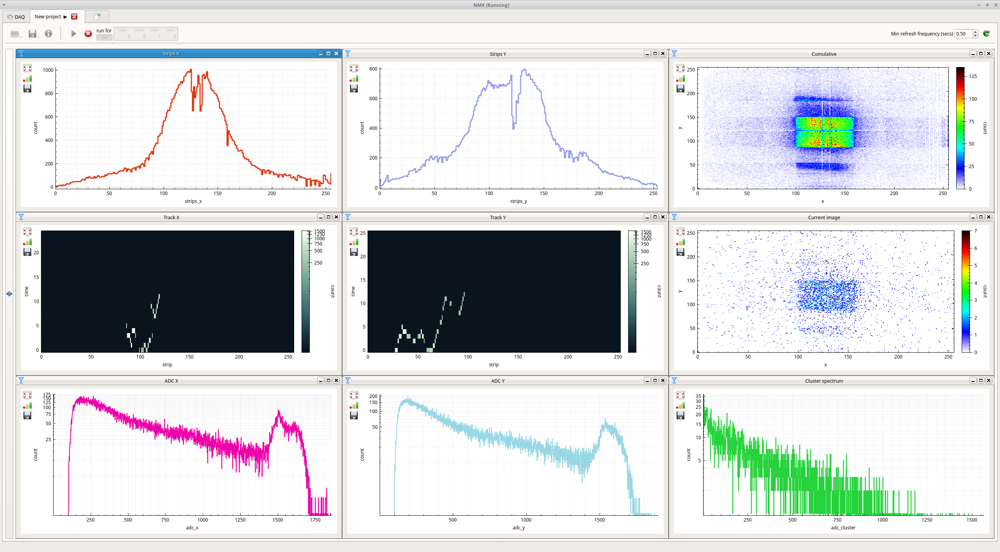

# DAQuiri
Versatile DAQ engine for physics detectors, event mode and otherwise, with a variety of histogram types for images, spectra, time-of-flight, activity.



## Installation

### Requirements

Supported platforms:
- Ubuntu 18.04
- macOS High Sierra

You definitely need these:
- git
- recent C++ compiler
- CMake 3.0
- Qt5 (on Ubuntu systems, the `qt5-default` package)
- conan 1.0 (via pip)

### Conan setup
To avoid C++ dependency hell, we use `conan`. The following repos need to be added:
```
conan remote add conancommunity https://api.bintray.com/conan/conan-community/conan
conan remote add conan-transit https://api.bintray.com/conan/conan/conan-transit
conan remote add ess-dmsc https://api.bintray.com/conan/ess-dmsc/conan
```
If you are on a `linux` sytem you also need to ensure that `conan` builds everything using the c++11 standard. Edit your `~/.conan/profiles/default` to replace `compiler.libcxx=libstdc++` with `compiler.libcxx=libstdc++11`.
If said file does not exists, you are likely yet to run `conan` for the frist time. Do the following to generate the above-mentioned file:
```
conan profile new --detect default
```

### Build

```
git clone --recurse-submodules https://github.com/ess-dmsc/daquiri.git
mkdir daquiri/build
cd daquiri/build
cmake ..
make -j
```

## Running

The binary you want to run is `./bin/daquiri` relative to your build directory.
Every time you run it, you need to activate the `conan`-generated virtual environment by sourcing `activate_run.sh`. Thus, if you are inside your build directory, do the following:

```
source ./activate_run.sh
./bin/daquiri
```

## Dependencies in custom locations

If your package manager did not provide Qt5 and you used Qt's web installer, you may need to set:
```
CMAKE_PREFIX_PATH=/somepath/Qt/5.5/gcc_64
```
either just prior to `cmake` or in your `~/.profile`

## Future features

You can see current tickets and their priorities on the [Kanban board](https://github.com/ess-dmsc/daquiri/projects/1)

Please send any feature requests you have to (martin.shetty@esss.se).
