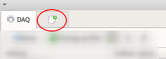
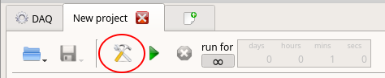
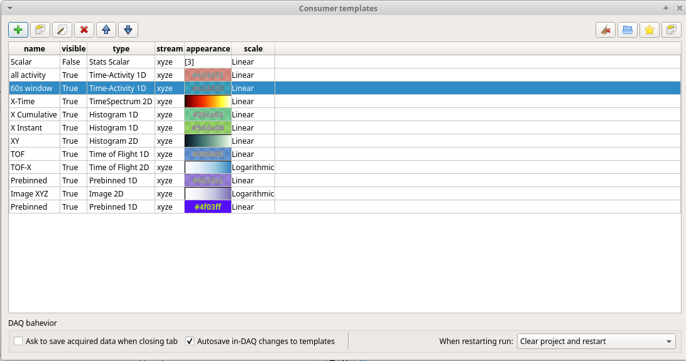
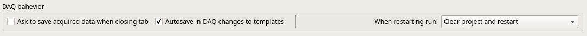
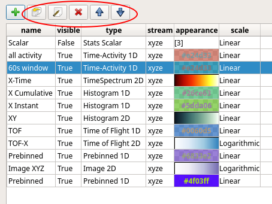
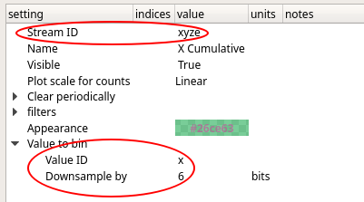

#Project view
If you see nothing in your histograms, but you are sure that data is flowing through Kafka,
you may want to test your profile configuration by taking a look at the data as it was
translated by your plugin into daquiri streams.

