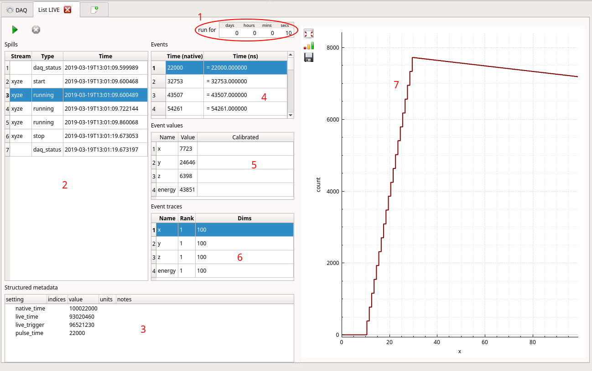

# List mode
If you see nothing in your histograms, but you are sure that data is flowing through Kafka,
you may want to test your profile configuration by taking a look at the data as it was
translated by your plugin (such as [ESSStream](../kafka_plugin/README.md)) into daquiri streams.

1. Run time should be something relatively short, long enough to receive something at current
rates, but not more. The full data run will be acquired to RAM before being returned for
display. Be aware that you will have to wait for the run to complete.
2. Under "Spills" you should see:
   - Two "daq_status" updates documenting in full the configuration of your profile at start
   and end of run.
   - A "start" and "stop" spill for each stream.
   - A number of "running" spills, if there was any actual data received.
   - When you select a spill, the other views will update to show you its structured contents.
3. Structured metadata is where you would see relevant "pulse time" for any event streams, a
setting tree for any "daq_status" spills, or any other statistics, such as dropped buffer counts.
4. Events from the same stream will have identical structure. No matter the stream, events will
have a reconstructed global timestamp, along with any clock interpretation as per time base.
They may also have:
5. Values, each a 16-bit scalar. This is where you can confirm that the logical geometry is
being interpreted correctly.
6. Traces, each an N-dimensional vector. These can also be histograms as already binned
    by the sending device/producer.
7. Selected 1-dimensional traces/histograms will be displayed on the right pane.
  
