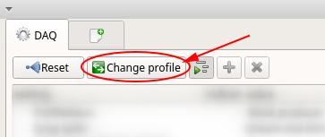
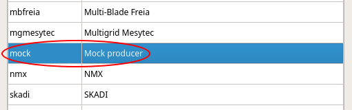
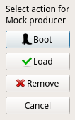
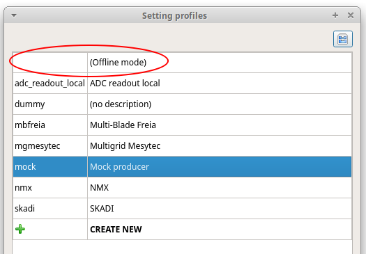
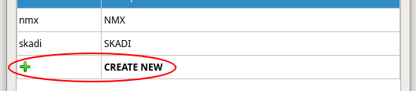
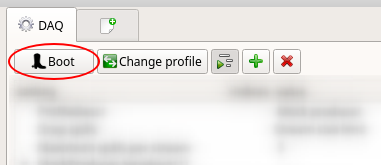
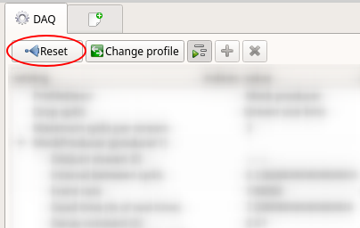
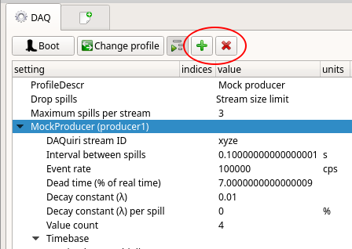
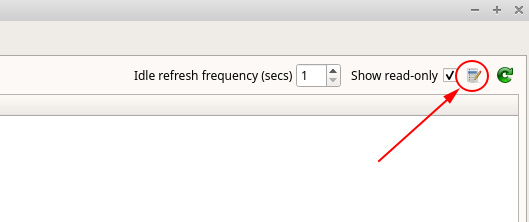

#Configuring profiles
The profile defines how data is to be acquired and displayed. You can have several 
profiles on the same computer for different devices or data streams. The first screen you 
should see when opening daquiri should be the DAQ config tab. It is here that you can
configure your

##Managing profiles.
Click "Change profile" to open the profile manager:

  

You may want to choose a home folder for where you keep all your profiles stored:

  

Here you see your currently selected profile:

  

If you double-click it, you get to chose what you want to do:

  

You can also use daquiri with a "null" profile, for viewing saved histograms:

  

Double-click on this to create a new profile:

  

## Using a profile

To acquire data, you will need to "boot" into the profile. Depending on your acquisition 
device, this might entail connecting with hardware or a streaming service:

  

You cannot edit a profile while "booted", so if you wish to change your hardware or stream
configuration, you must "Reset":

  

These two buttons will allow you to either add or remove a daquiri producer plugin:

  

Upon newly configuring a data source, or for trouble-shooting, you may want to examine
the interpreted data using list mode:

  

Once you have all of this working, you should configure your histograms.