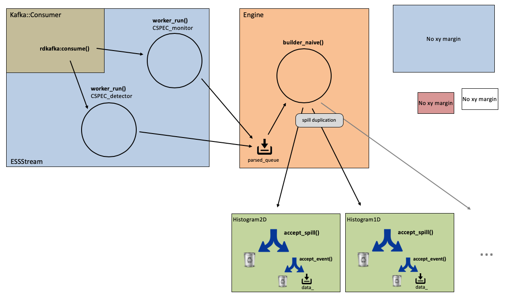

# Architecture
This is a high level description of Daquiri's architecture. It covers the control path, data path and the GUI (eventually).

Some key classes are shown/described in [Code](code.md).

## Control Path
To be created - Not available yet

## Data Path
The main data object being passed around is the **Spill** (*Spill.h*). A spill contains Kafka data obtained from *consume()* together with configuration data, control data and other meta data.

### Daquiri producers
The data path is illustrated in the figure below. It consists of a number of worker threads which receive flatbuffer data from Kafka topics. These threads are called producers in Daquiri terminology as they produce (Spill) data to the Engine. This terminology is independent of Kafka producer/consumer terminology. In fact the producer threads are Kafka consumers.

There is one thread per topic (**worker_run()** in *ESSStream.cpp*). The exact number of threads depends on the project configuration. There are other
types of producers, but for most (all?) detector data we use the **ESSStream** producer class.

Producers are passed a pointer to an output queue object, so they could write to different queues. In practice (as of 2020-06) they all write to the same queue (**parsed_queue**).

Another thread (**builder_naive** in *Engine.cpp*) continuously pull **Spills** from **parsed_queue** and pass them on (copying/duplicating?) to the Consumers' individual consumer queues.

### Daquiri consumers
Daquiri has a numbers of consumers such as **Histogram3D**, **Histogram2D**, **TOF1D**, etc. (search for 'public Spectrum' to identify consumers).

Not all consumers are interested in all spills. Spills for individual consumers are accepted by the **accept_spill()** method. Furthermore not all events in a spill may be relevant. Events are accepted by the **accept_event()** method.

## GUI
This is mostly a description on the workflow from startup to running an acquisition. Other relevant topics such as creating and editing profiles and plots are currently omitted.
