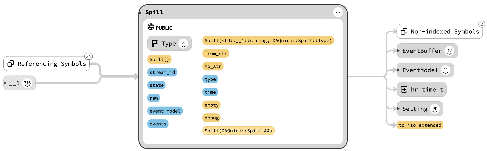
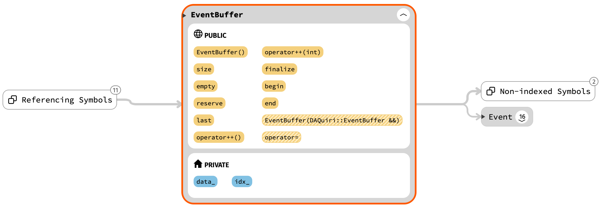
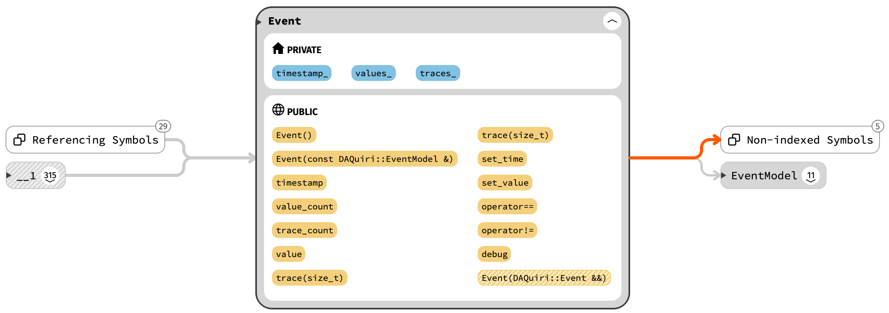
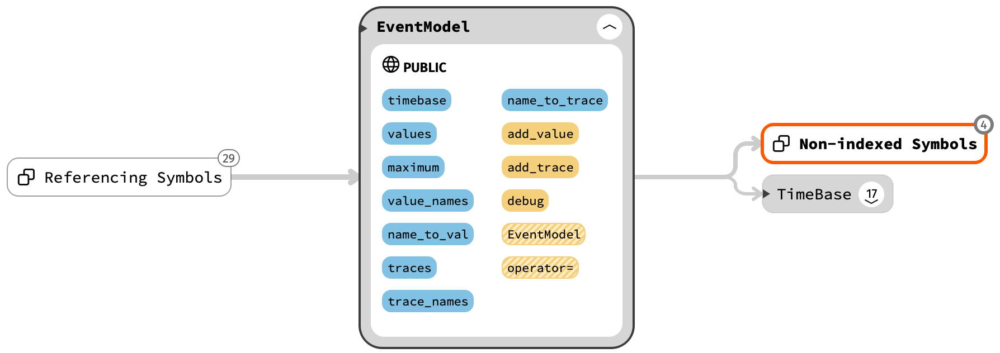

# Classes and relations
The figures here were obtained using [SourceTrail](https://github.com/CoatiSoftware/Sourcetrail). The
figures were correct as of June 2020. Color codes: Yellow: methods, blue: variables, grey: enums.

## Kafka and events

### Spill

### EventBuffer

### Event

### EventModel

