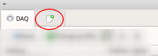
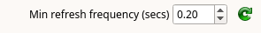
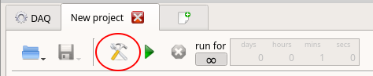
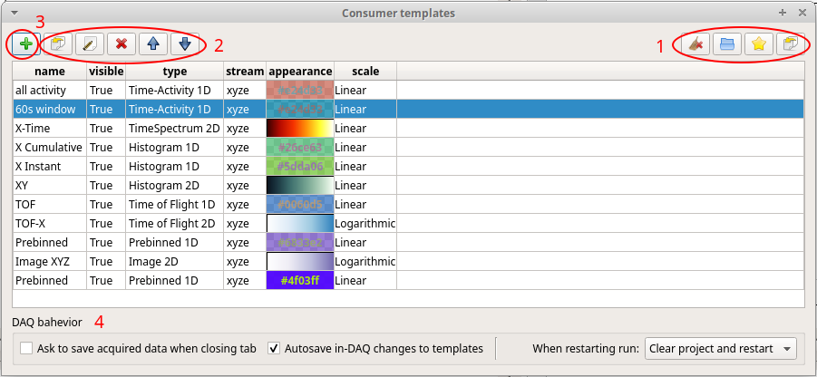
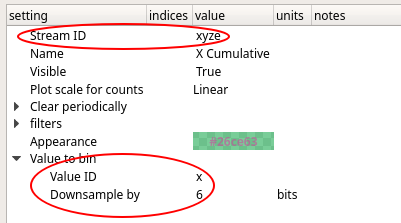

# Project view
A DAQ project consists of a set of consumers, which are most commonly histograms. You can have
multiple projects open at the same time. Open a new project right here: 

<!-- TODO: overview of main tool bar for project view -->

On the right you have controls for refreshing the visualization. If the GUI is unresponsive, you
may have too many graphics updates taking place.

Click this to configure your histograms:

## Consumer templates

In daquiri, histograms are the event data consumers. In fact, they don't have to be histograms, but 
can be sclar monitor values and the like. Each time you begin a run, a set of consumers is 
constructed on the basis of the templates configured here: 

1. Clear, save or load the consumer list. You can import templates from saved projects. Clicking
the star saves current config as default. You can do this just in case if you anticipate problems.
2. Manipulate selected entry. You can clone, edit or delete them. The order determines their placement in the window.
 Double clicking on an entry begins editing.
3. Add a new consumer.  
4. Here is your default behavior for restarting runs and whether you want interactive changes to
histograms to be saved to the templates for your next acquisition.

## Configuring a consumer

The most important thing is to ensure that the histogram latches onto the correct daquiri data
stream. Event values from particular data streams are also a common setting. If you have 
changed anything in your profile's producer configuration, you may want to recheck the stream
and event value settings here. Select the stream first, and then select your values. Values
may be down-sampled by bitshifting. If histograms are too large and take too long to render,
you may want to reduce the resolution. 

