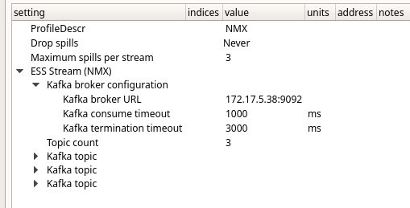
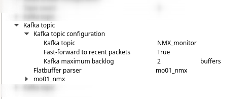
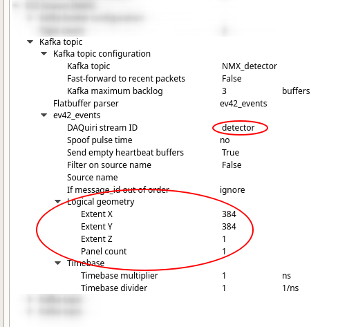
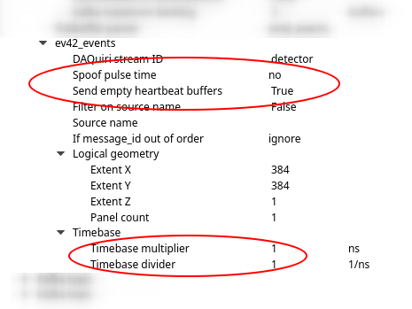
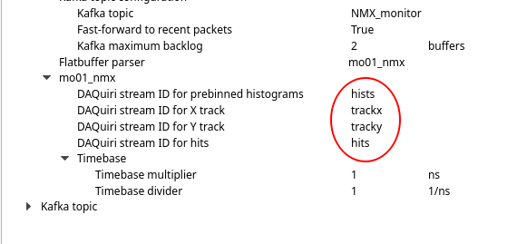

# ESS Stream plugin

## Background
This plugin receives data from a Kafka broker and provides values for histogramming. 
In the Kafka context, this entails establishing consumers. However, from the perspective of 
daquiri, the plugin constitutes a producer. Once the plugin has interpreted a buffer 
according to the appropriate flatbuffer schema, the event data is delivered to the histogramming 
service via internal "streams".

## Kafka broker configuration
Once you have added an "ESSStream" plugin to your profile configuration, you should set your
Kafka broker: 

  

You can now establish consumers for multiple Kafka topics. The "fast-forward" option allows
you to start dropping packets if daquiri is not keeping up with the data rates. This may be
desirable if you want to see the most up-to-date images, but you will have no guarantee that
they are representative. If you wish to faithfully histogram the data, this option should
be off.

## Kafka topic configuration

  

For each topic you must select a flat buffer schema for parsing. There is currently no
auto-detection of schema or multiplexing support implemented, so if you have different
types of data incoming, you must stream them on separate topics.

## The ev42 schema

Here is where you must provide an identifier string for the internal daquiri stream. These ids will
reappear when configuring histograms to bin specific values. Depending on the chosen schema,
a single Kafka topic may translate into multiple daquiri streams.

If your schema requires a logical geometry configuration, it must match that used by the EFU
when producing the data. This tells the plugin how to translate pixel ids into coordinate
values. The EFU's logical geometry configuration is most likely in the detector-specific json file.

<!-- TODO: add link to public document on logical geometry -->
  

When working with prototype detectors, timing information may not be fully available. If your
does not provide valid offset (pulse) time for each data frame, you may want daquiri
to keep a local "high clock" to ensure that timestamps are monotonically increasing.

If you are getting valid timing data and expect to have meaningful TOF (or other time-based)
histograms, you should also configure the time-base of your clock. You will not be able to construct
meaningful TOF histograms if pulse information is not provided by the EFU.

<!-- TODO: add time base examples -->

  

## Other schema (mo01_nmx)
Here is an example of a schema that results in multiple daquiri data streams. Since these 
fields constitute independent sets of information, we separate them out for before binning. Make sure the
stream identifiers are unique.

  

