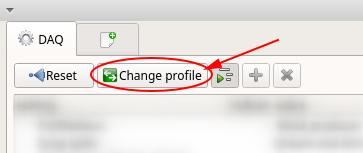
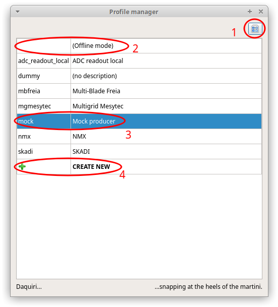
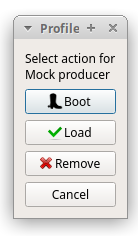
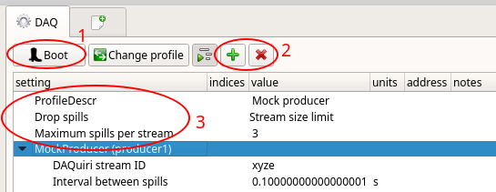
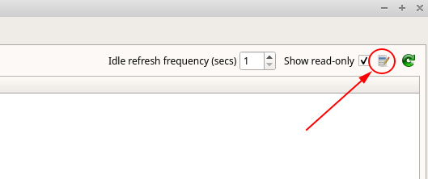

# Configuring profiles
The profile defines how data is to be acquired and displayed. You can have several 
profiles on the same computer for hardware or network contexts you might find yourself in.
The first screen you should see when opening daquiri should be the DAQ config tab. It is here that
you can begin configuring your profiles.

## Managing profiles
Click "Change profile" to open the profile manager:

  

Which should bring you to this:

1. You may want to choose a home folder for where you keep all your profiles stored. The
default location is assumed to be /home/essdaq/daquiri
2. You can use daquiri with a "null" profile, for viewing saved histograms.
3. This is your currently active profile.
4. Double-click on this to create a new profile.

When you double-click a profile, you get to chose what to do. More on what booting means in a moment.

  

## Using a profile

1. To acquire data, you will need to "boot" into the profile. Depending on your acquisition 
device, this might entail connecting with hardware or a streaming service. You cannot edit a
profile while "booted", so if you wish to change your hardware or stream configuration, you
must "Reset".
2. These two buttons will allow you to either add or remove a daquiri producer plugin.
 You most likely want to configure an [ESSStream plugin](../kafka_plugin/README.md) for Kafka.
3. Here you can adjust how the daquiri engine behaves in case of saturation. If binning
histograms takes too long, there may be a backlog of spills in the queue. Here you can adjust the
policy for dropping data to reduce lag.
  

Upon newly configuring your profile, or for trouble-shooting, you may also want to examine
the interpreted data using [list mode](../list/README.md) which you can access here:

  
